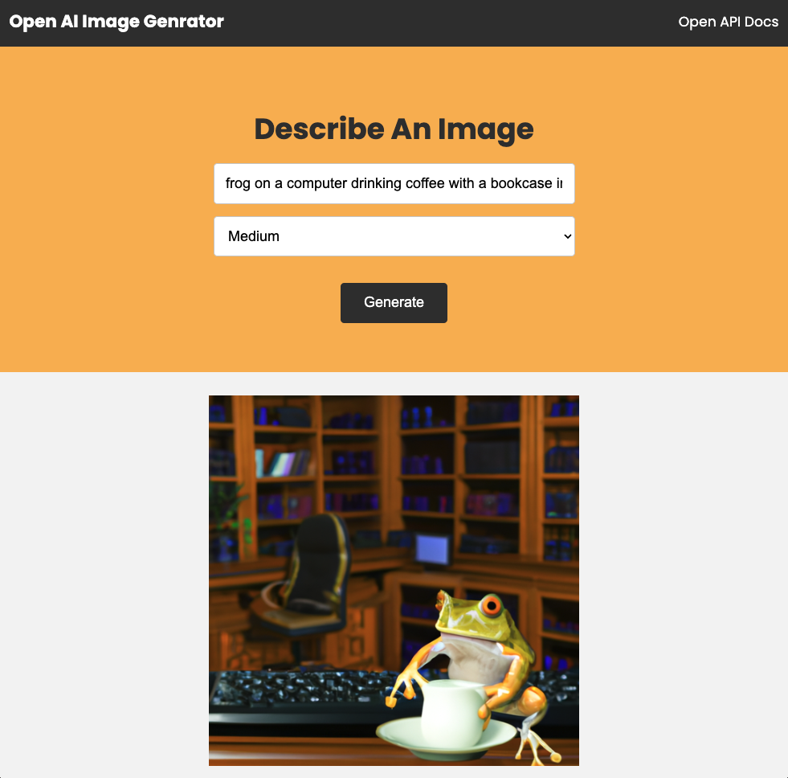

# OpenAI Image Generator

## Thanks to  Traversmedia

youtube video  [Link](https://www.youtube.com/watch?v=fU4o_BKaUZE) to generate images.

This is a simple image generator built with Node.js and Express that uses [OpenAI's Dall-E models](https://beta.openai.com/docs/guides/images) 



## Usage

## How to start

Setup docker in your system 

Pull the docker image

```bash 
docker pull ajmaldocker07/openai-node:latest
```

Create docker container

```bash
docker run -d -p 5000:5000 ajmaldocker07/openai-node:latest
```

Visit `http://localhost:5000` in your browser.

The endpoint is at `POST http://localhost:5000/openai/generateimage`.
